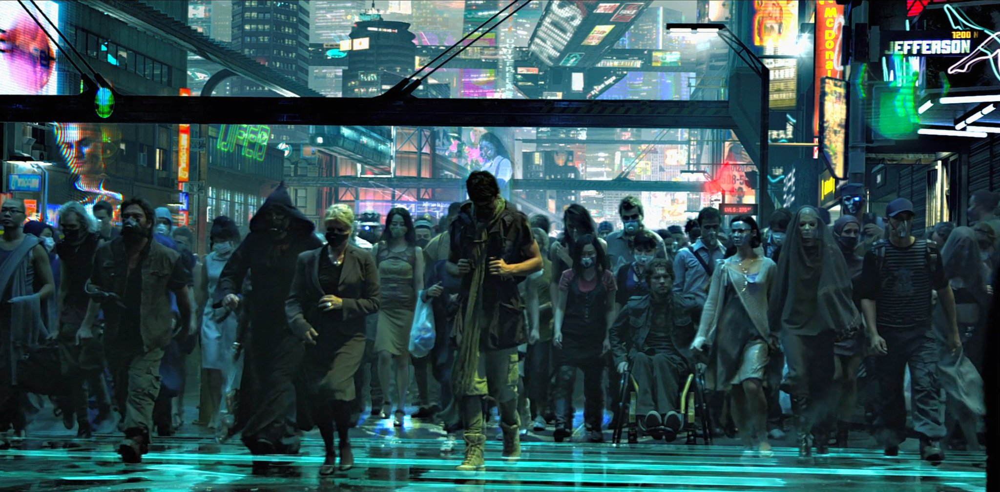

# [Cyberpunk 101](https://github.com/0x00er/cyberpunk-101)

**Cyberpunk for Dummies: Because the Future is Confusing**

# Awesome Cyberpunk: Resources for the Neon Shadowrunner

**Welcome to your one-stop shop for all things cyberpunk!** Whether you're a seasoned netwalker or a curious newbie, this curated list provides a deep dive into the genre's core themes, technology, and communities.

Forget the drek-infested dregs of the datastream, chummer! Dive into the neon labyrinth of cyberpunk with this curated stash of resources. Whether you're a seasoned netrunner or a curious noob just waking up to the megacorporate matrix, this guide will boost your signal and get you wired into the heart of the genre.

### Beyond the Basics:

**Movies:**

* **Blade Runner (1982):** https://www.imdb.com/title/tt0083658/
* **Ghost in the Shell (1995):** https://myanimelist.net/anime/43/Koukaku_Kidoutai
* **Akira (1988):** https://myanimelist.net/anime/47/Akira
* **Existenz (1999):** https://www.youtube.com/watch?v=HAdbdUt_h9M
* **Dredd (2012):** https://www.imdb.com/title/tt1343727/

**Games:**

* **Cyberpunk 2077:** https://en.wikipedia.org/wiki/Cyberpunk_2077
* **Shadowrun series:** https://store.catalystgamelabs.com/products/shadowrun-sixth-world-core-rulebook
* **Deus Ex series:** https://en.wikipedia.org/wiki/Deus_Ex:_Human_Revolution
* **Transistor:** https://www.supergiantgames.com/games/transistor/
* **Ghostrunner:** https://store.steampowered.com/app/1139900/Ghostrunner/

**Books:**

* **Neuromancer by William Gibson:** https://www.penguinrandomhouse.com/books/538861/neuromancer-by-william-gibson/
* **Do Androids Dream of Electric Sheep? by Philip K. Dick:** https://www.penguinrandomhouse.ca/books/40617/do-androids-dream-of-electric-sheep-by-philip-k-dick/9780345404473
* **Snow Crash by Neal Stephenson:** https://www.barnesandnoble.com/w/snow-crash-neal-stephenson/1100301882
* **Altered Carbon by Richard K. Morgan:** https://www.goodreads.com/book/show/40792913-altered-carbon

**Art & Music:**

* **Cyberpunk 2077 soundtrack:** https://open.spotify.com/album/1B2QrHbMox8vPXUY7rXAFp
* **Perturbator:** https://perturbator.bandcamp.com/music
* **Carpenter Brut:** https://carpenterbrut.bandcamp.com/
* **Jenny LeClue art:** https://ariel-s-awesome.tumblr.com/post/654255713142620160/jenny-leclue-ended-up-hitting-both-my-grew-up

### Deep Dive:

**Cyberpunk subreddits:**

* **r/Cyberpunk:** https://www.reddit.com/r/cyberpunkgame/
* **r/Shadowrun:** https://www.reddit.com/r/Shadowrun/
* **r/Cyberpunk2077:** https://www.reddit.com/r/cyberpunkgame/

**Cyberpunk blogs & websites:**

* **Neon Dystopia:** https://www.facebook.com/neondystopia/
* **A Critical Look at Cyberpunk:** https://cyberpunk.fandom.com/wiki/Critical_Error_%28perk%29
* **The Cyberpunk Database:** https://cyberpunkdatabase.net/

**Podcasts:**

* **Cyberpunk: Down The Rabbit Hole:** https://soundcloud.com/myuu/down-the-rabbit-hole
* **Glitch in the System:** https://open.spotify.com/show/6wc9yNagdvauJ3NJf1pwpS
* **Shadowrun: Sprawl Talk:** https://www.rpgpub.com/threads/shadowrun-in-the-sprawl.2371/

### Explore the neon labyrinth with these sections:

* **Cyberpunk:**
    * **FAQ:** https://sizeof.cat/post/cyberpunk-faq/
    * **What is /cyb/erpunk?:** https://pastebin.com/pmn9vzWZ
    * **How do I into /cyb/erpunk?:** https://pastebin.com/5tpNFQds
    * **Huge list of cyberpunk media:** https://sizeof.cat/post/cyberpunk/
    * **The cyberdeck:** https://pastebin.com/7fE4BVBg
    * **Cyberlife:** https://jinteki.industries/files/cyberlife.7z
    * **Bibliothek:** https://www.mediafire.com/folder/4m5hd2065hde8/Bibliothek

* **Reverse Engineering:**
    * **Getting into /re/:** https://wiki.installgentoo.com/wiki/Reverse_Engineering

* **Security:**
    * **"Shit just got real":** https://pastebin.com/rqrLK6X0
    * **Cybersecurity basics:** https://wiki.installgentoo.com/wiki/Cybersecurity_-_/sec/_guide
    * **and armory:** https://wiki.installgentoo.com/wiki/Cybersecurity_-_basics_and_armory
    * **learning:** https://wiki.installgentoo.com/wiki/Cybersecurity_-_Learning/News/CTFs
    * **Reference books (PW: ABD52oM8T1fghmY0):** https://mega.nz/#F!YigVhZCZ!RznVxTiA0iN-N6Ps01pEJw
    * **PDFs:** https://mega.nz/#F!zGJT1QQQ!O-8yiH845GN26ajAvkoLkA
    * **EFF anti-surveillance:** https://ssd.eff.org/
    * **Other library:** https://mega.nz/file/UCgEGAjb#rwNcnMAQCUUbSp8supsFvn9QEHCWUW86eLcZa16ZG4Y

* **Privacy:**
    * **Tools:** https://www.privacyguides.org/en/tools/
    * **Hitchhiker’s Guide:** https://anonymousplanet.org/guide.html
    * **Hardware:** https://ryf.fsf.org/products
    * **Frontends:** https://wiki.installgentoo.com/wiki/Privacy_friendly_frontends
    * **OSINT Guide:** https://inteltechniques.com/index.html
    * **Firmware:** https://libreboot.org/
    * **RMS:** https://stallman.org/facebook.html

* **Hackerman General:**
    * **VM/CTFs:**
        * http://overthewire.org/wargames/bandit/ - easy beginner
        * https://www.vulnhub.com/ - prebroken images
        * https://www.hackthebox.eu/ - super secret club
    * **Huge info dump:** https://hmg.neocities.org/

**Stay tuned for updates and contributions!** Want to be part of the project? See the "Contributing" section below.

## Stay Frosty, Chummer!

**Remember, the streets may be mean, but the data's free. Now go forth and explore the neon labyrinth, glitch the system, and rewrite the future!**

***Don't get lost in the neon shadows, runner. Use these resources wisely, hack the system, and carve your own path in the cyberpunk world!***

## Contributing:

If you have resources you think belong in this list, feel free to contribute! Fork the repository, make your changes, and submit a pull request.

## Remember:

The journey into the cyberpunk world is yours to forge. Hack the system, stay vigilant, and enjoy the ride!
